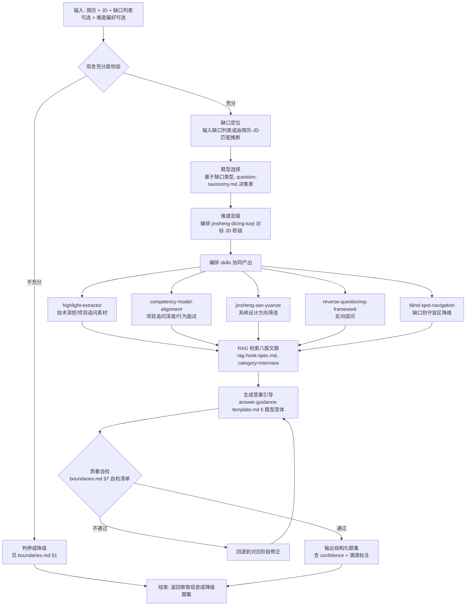

# generation-flow.md — 面试题集生成流程

> 本文件是 `../SKILL.md` 步骤 7 的路由细则，定义题集端到端生成流程、每阶段说明与触发条件。返回上层路由见 `../SKILL.md`。
> 题型细则见 `../rules/question-taxonomy.md`；难度见 `../rules/difficulty-grading.md`；答案引导见 `../rules/answer-guidance-template.md`；RAG 外挂见 `../rules/rag-hook-spec.md`；边界见 `../rules/boundaries.md`。

## 1. Mermaid 流程图



---

## 2. 文字回退流程图（mermaid 不可用时）

```
输入：简历 + JD + 缺口列表(可选) + 难度偏好(可选)
  │
  ▼
[0] 信息充分度校验（rules/boundaries.md §1）
  │  ├─ 简历<200字 / JD<100字 / 无技术栈交集 / 造假信号？ ──是──▶ 判停，返回索取信息
  │  ├─ JD 缺职级信号？ ──是──▶ 降级：难度回退 L1+L2 默认 P5/P6 档
  │  └─ 通过 ──▶ 继续
  ▼
[1] 缺口定位
  │  输入：缺口列表（用户提供）或由简历-JD 匹配推断（jd-resume-matcher 产出）
  │  产出：能力缺口清单（技术栈缺口 / 项目深度缺口 / 软技能缺口 / 职级经验缺口）
  ▼
[2] 题型选择（基于缺口类型 → rules/question-taxonomy.md 决策表）
  │  ├─ 技术栈缺口 → 技术深挖题 + 八股文题
  │  ├─ 项目深度缺口 → 项目追问题
  │  ├─ 高并发/大规模要求 → 系统设计题
  │  ├─ 协作/领导/抗压要求 → 行为面试题
  │  ├─ 全流程准备 → 6 类按配比
  │  └─ 缺口防守 → 追加 blind-spot-navigation 盲区降维预案
  │  产出：本次题集题型配比表（约 15-20 题）
  ▼
[3] 难度定级（编排 jinsheng-dicing-luoji 对标 JD 职级）
  │  输入：JD 职级信号（年限/带领/主导）+ 难度偏好
  │  处理：用 jinsheng-dicing-luoji 晋升底层逻辑映射 JD 要求到 P5-P8 band
  │        band → 难度梯度（rules/difficulty-grading.md 职级-难度-题型映射总表）
  │  产出：每级难度题量（L1 到目标级别，L4 仅 P8+ 且最多 1 题）
  ▼
[4] 编排 skills 协同产出（并行）
  │  ├─ highlight-extractor      → 从简历榨取技术深挖/项目追问靶点
  │  ├─ competency-model-alignment → 按四层模型组织项目追问深度 + 设计行为面试题
  │  ├─ jinsheng-san-yuanze      → 用价值原则筛选系统设计题方向
  │  ├─ reverse-questioning-framework → 三元交集生成反向提问
  │  └─ blind-spot-navigation    → 针对缺口生成盲区降维预案
  │  产出：各题型题干草稿（含 resume_ref / jd_ref 溯源）
  ▼
[5] RAG 检索八股文题（rules/rag-hook-spec.md）
  │  输入：技术栈(简历∩JD) + 难度(L1-L2) + 数量
  │  处理：semanticSearch(category='interview') → 标签过滤 → rerank
  │  产出：八股文题（verified 题库命中 + fallback AI 生成标记）
  ▼
[6] 生成答案引导（rules/answer-guidance-template.md）
  │  对每题套用对应题型变体模板：
  │    题目 + 参考答案(核心观点+展开+代码) + 回答引导(STAR+追问+评分) + 考察点(冰山维度) + 难度 + 常见错误
  │  产出：完整题集（每题 7 字段齐全）
  ▼
[7] 质量自检（rules/boundaries.md §7 自检清单）
  │  ├─ 不通过 → 回退到对应阶段修正（造题→[4]、配比失衡→[2]、歧视→删除重出）
  │  └─ 通过 → 继续
  ▼
[8] 输出题集
  │  含 confidence + 每题溯源标注 + 题库验证标记 + "定制题集非题海"声明
  ▼
输出：结构化题集 JSON（供 RAG 检索 / skills-loader 注入 system prompt / 人阅读）
```

---

## 3. 每阶段说明与触发条件

| 阶段 | 触发条件 | 输入 | 产出 | 路由细则 |
|------|---------|------|------|---------|
| [0] 信息校验 | 每次激活必跑 | 简历+JD | 通过/判停/降级信号 | `boundaries.md` §1 |
| [1] 缺口定位 | [0] 通过 | 简历+JD+缺口列表(可选) | 能力缺口清单 | 缺口分类参考 `jd-resume-matcher` 产出 |
| [2] 题型选择 | [1] 完成 | 缺口清单+JD 要求 | 题型配比表 | `question-taxonomy.md` 决策表 |
| [3] 难度定级 | [2] 完成 | JD 职级信号+偏好 | 每级题量 | `difficulty-grading.md` + 编排 `jinsheng-dicing-luoji` |
| [4] 编排 skills | [2][3] 完成 | 简历+JD+缺口+配比+难度 | 各题型题干草稿 | `question-taxonomy.md` 各题型编排表 + `../SKILL.md` 步骤 4 |
| [5] RAG 检索八股 | [4] 技术栈确定 | 技术栈+难度+数量 | 八股文题 | `rag-hook-spec.md` |
| [6] 生成答案引导 | [4][5] 完成 | 全部题干 | 完整题集(7 字段) | `answer-guidance-template.md` |
| [7] 质量自检 | [6] 完成 | 完整题集 | 通过/回退信号 | `boundaries.md` §7 |
| [8] 输出题集 | [7] 通过 | 合格题集 | 结构化题集 JSON | `../prompts/interview-questions.prompt.md` 输出 schema |

---

## 4. 步骤依赖与并行性

| 步骤 | 依赖前置 | 可并行 |
|------|---------|--------|
| [0] 信息校验 | 无 | — |
| [1] 缺口定位 | [0] 通过 | — |
| [2] 题型选择 | [1] | — |
| [3] 难度定级 | [2]（需题型配比确定难度题量） | — |
| [4] 编排 skills | [2] + [3] | [4] 内部 5 个 skill 可并行（highlight-extractor / competency-model-alignment / jinsheng-san-yuanze / reverse-questioning-framework / blind-spot-navigation 互不依赖） |
| [5] RAG 检索八股 | [4] 确定 tech stack | 可与 [4] 的非八股题型并行 |
| [6] 生成答案引导 | [4] + [5] 全部题干 | — |
| [7] 质量自检 | [6] | — |
| [8] 输出 | [7] 通过 | — |

**最优执行序**：[0] → [1] → [2] → [3] → ([4] 内部 5 skill 并行 ∥ [5] RAG 检索) → [6] → [7] → [8]。其中 [4] 的 5 个 skill 编排与 [5] 八股检索可并行，是主要加速点。

---

## 5. 降级流（信息不足或题库未命中时）

### 5.1 信息不足降级（[0] 触发）

```
[0] 判定信息不足
  ▼
[1] 缺口定位 → 跳过（缺口无法定位）
[2] 题型选择 → 仅保留八股文题（若有技术栈）或不出题
[3] 难度定级 → 回退 L1+L2 默认 P5/P6 档
[4] 编排 skills → 跳过 highlight-extractor（简历不足无法榨取），仅保留 RAG 可支撑部分
[5] RAG 检索 → 正常（若技术栈可识别）
[6] 生成答案引导 → 仅八股文题
[7] 自检 → confidence<0.5 置顶告警
[8] 输出 → 降级题集，置顶"信息不足，题集不完整，建议补充输入"
```

### 5.2 题库未命中降级（[5] 触发）

按 `rag-hook-spec.md` §4 fallback 策略：题库零命中或不足时 AI 生成补足，标记 `verified:false`，全 fallback 时题集置顶"八股文题未经题库验证"告警。

### 5.3 自检回退（[7] 触发）

| 自检失败项 | 回退到 | 修正动作 |
|-----------|-------|---------|
| 题目缺溯源标注 | [4] | 补 `resume_ref`/`jd_ref` 或删除 |
| 造题（编造技术栈/项目） | [4] | 删除该题，归入 `blind-spot-navigation` |
| 歧视性/违规题 | [4] | 直接删除，不洗白 |
| 题型配比失衡 | [2] | 重排配比补题 |
| L4 超 1 题或非 P8+ | [3] | 删除多余 L4 题 |
| 八股文题未标 verified | [5] | 补标 `verified` 字段 |

---

## 6. 数据流契约（与现有代码）

```
简历 + JD + 缺口列表
  │
  ▼
interview-question-generator（本 skill）──▶ 结构化题集 JSON
                                              │
                                              ├─▶ RAG 检索（题集作为可检索知识片段，category=interview）
                                              ├─▶ skills-loader 注入 system prompt（src/server/rag/skills-loader.ts）
                                              └─▶ 人阅读（前端 SSE 流式展示，src/app/api/chat/route.ts）
```

题集 JSON 的 schema 见 `../prompts/interview-questions.prompt.md` 输出格式。字段命名与 `src/lib/rag/types.ts` 的 `RAGResult` 兼容（`content`/`source`/`category`/`score`），确保可被 RAG 流水线与 skills-loader 无缝消费。

---

## 7. 引用关系

- 流程入口 → `../SKILL.md` E 节步骤 1-7
- 阶段细则 → `../rules/` 各文件
- 题库检索调优 → `./question-bank-integration.md`
- 输出 schema → `../prompts/interview-questions.prompt.md`
- 数据流对接 → `src/lib/rag/`（shim）→ `src/server/rag/`
