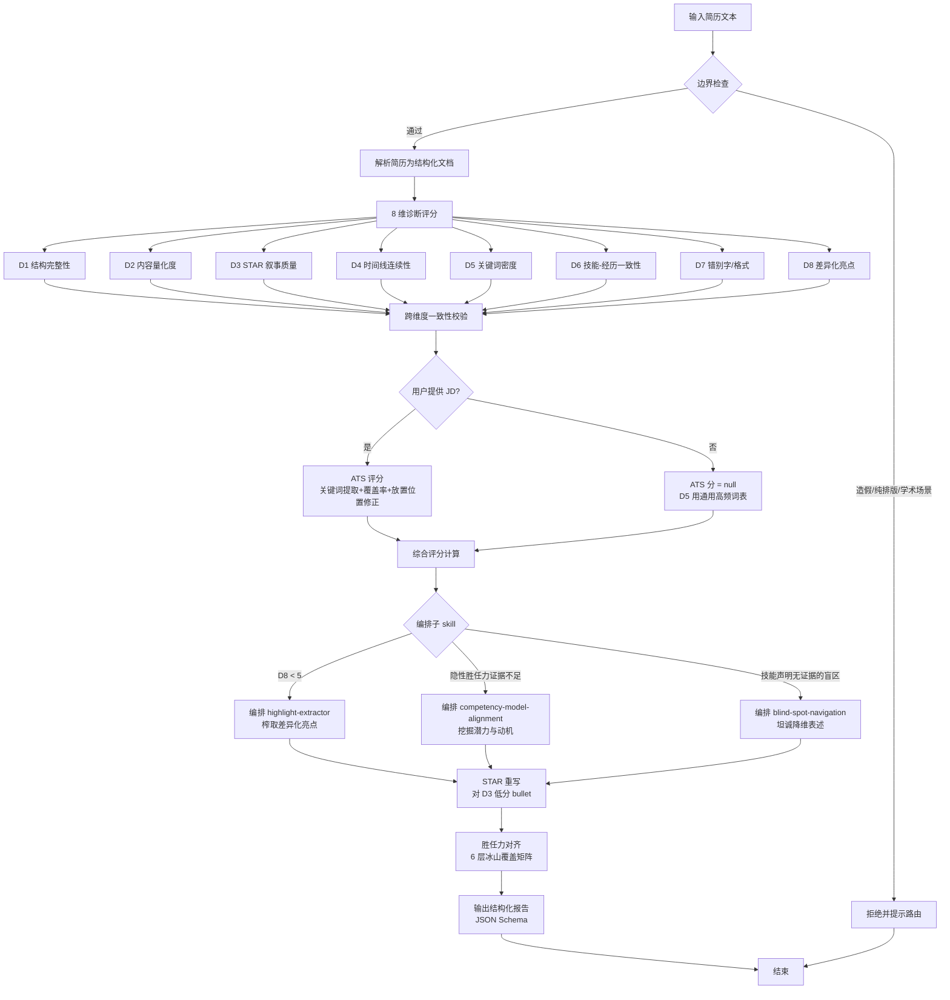

# 执行流程图

> 本文件定义 `resume-evaluator` skill 的端到端执行流程。AI 按此顺序执行，不可跳步。

## 1. Mermaid 流程图



## 2. 文字流程图（mermaid 不可用时的回退）

```
[输入简历文本]
       │
       ▼
[边界检查] ──(造假/纯排版/学术)──▶ [拒绝 + 路由提示] ──▶ [结束]
       │(通过)
       ▼
[解析简历 → 结构化文档]
       │
       ▼
[8 维诊断评分]
  ├─ D1 结构完整性
  ├─ D2 内容量化度
  ├─ D3 STAR 叙事质量
  ├─ D4 时间线连续性
  ├─ D5 关键词密度
  ├─ D6 技能-经历一致性
  ├─ D7 错别字/格式
  └─ D8 差异化亮点
       │
       ▼
[跨维度一致性校验]
       │
       ▼
[有 JD?] ──(是)──▶ [ATS 评分：关键词提取 + 覆盖率 + 放置位置修正]
       │                                          │
       │(否)──▶ [ATS = null；D5 用通用高频词表]   │
       │                                          │
       ▼◀─────────────────────────────────────────┘
[综合评分计算：DiagnosticScore (+ATS) → TotalScore]
       │
       ▼
[编排子 skill（并行触发条件）]
  ├─ D8 < 5                  ──▶ [highlight-extractor：榨取亮点]
  ├─ 隐性胜任力证据不足       ──▶ [competency-model-alignment：挖潜力动机]
  └─ 技能声明无证据的盲区     ──▶ [blind-spot-navigation：坦诚降维]
       │
       ▼
[STAR 重写：对 D3 低分 bullet 按 rules/star-rewrite.md 模板]
       │
       ▼
[胜任力对齐：6 层冰山覆盖矩阵 + 缺口建议]
       │
       ▼
[输出结构化报告：按 prompts/resume-analysis.prompt.md 的 JSON Schema]
       │
       ▼
[结束]
```

## 3. 阶段说明

| 阶段 | 输入 | 产出 | 对应文件 |
|------|------|------|---------|
| 1. 边界检查 | 简历文本 + 用户诉求 | 通过/拒绝 | `rules/boundaries.md` |
| 2. 解析 | 简历文本 | 结构化 ResumeDocument | （代码层 parser） |
| 3. 8 维诊断 | ResumeDocument | 8 个 0-10 分 + 扣分依据 | `rules/diagnostics-8dim.md` + `scripts/diagnostic-checklist.md` |
| 4. ATS 评分 | ResumeDocument + JD(可选) | 覆盖率 + 匹配分 | `rules/ats-scoring.md` |
| 5. 综合评分 | 8 维分 + ATS 分 | TotalScore(0-100) + 置信度 | `scripts/scoring-formula.md` |
| 6. 编排子 skill | 低分维度触发 | 亮点/胜任力/盲区话术 | 子 skill SKILL.md |
| 7. STAR 重写 | D3 低分 bullet | 重写建议 | `rules/star-rewrite.md` |
| 8. 胜任力对齐 | ResumeDocument + JD 胜任力 | 6 层覆盖矩阵 | `rules/competency-alignment.md` |
| 9. 输出报告 | 以上全部 | JSON 报告 | `prompts/resume-analysis.prompt.md` |

## 4. 编排触发条件速查

| 条件 | 触发的子 skill | 产出用途 |
|------|---------------|---------|
| D8（差异化亮点）< 5 | highlight-extractor | 补充维度 8 的亮点素材 |
| 隐性胜任力（社会角色/自我认知/特质/动机）证据不足 | competency-model-alignment | 挖掘潜力与动机行为证据 |
| 技能栏声明但经历无证据（D6 低分） | blind-spot-navigation | 给出盲区的坦诚降维表述 |
| D3（STAR 叙事）< 6 | （本 skill 内部）rules/star-rewrite.md | 重写低分 bullet |

## 5. 失败回退

- 简历解析失败（图片/扫描件）→ 跳过诊断，提示用户提供文本版，Confidence=0。
- JD 关键词提取 LLM 失败 → 回退 TF 词频提取（见 `rules/ats-scoring.md` §2.1）。
- 子 skill 编排无有效产出 → 报告对应段标注"需用户补充信息"，不编造。
